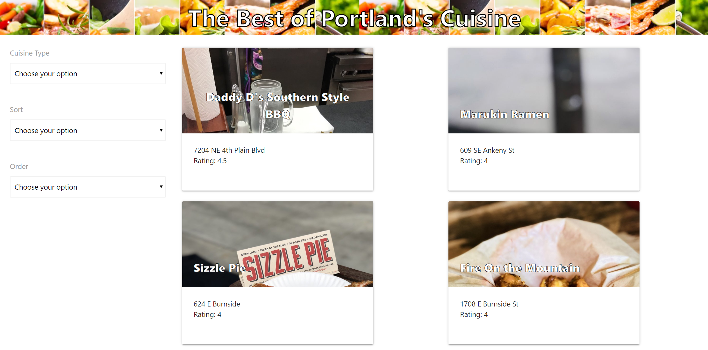
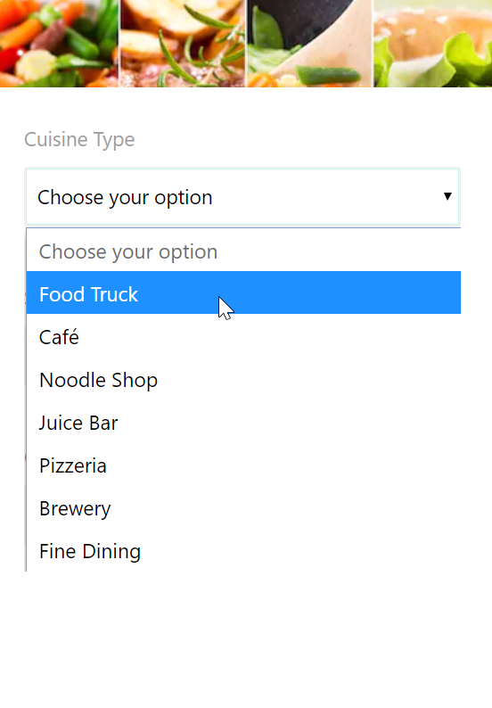
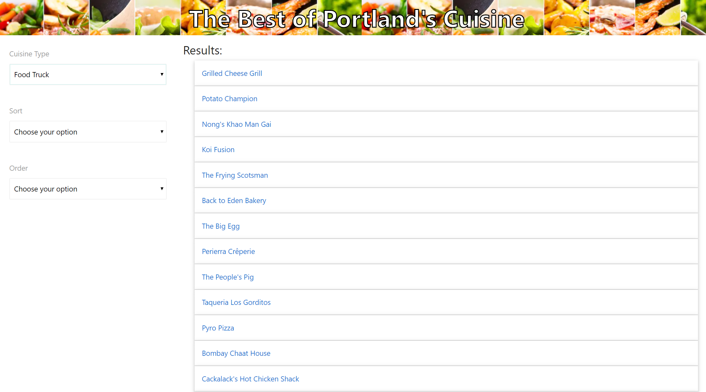
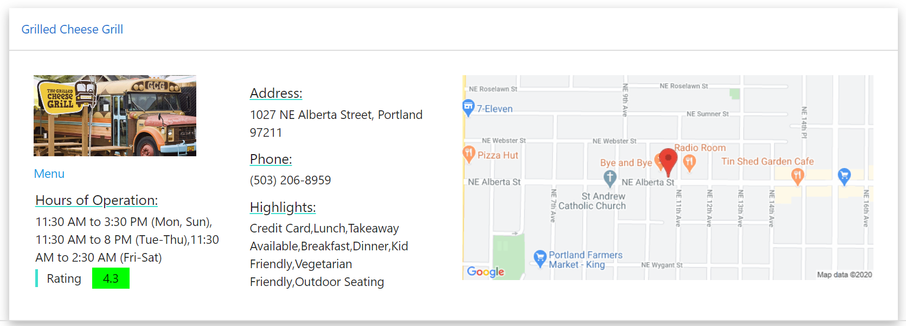

# Portland Cuisine

## User Story
AS A Portlandian I WANT a food app that will show all food trucks/hole in the wall places SO THAT I can experience a diverse cuisine.

## Introduction to our Project

1. The purpose of our project/application was to allow users to experience some of the hidden gems of Portland's culinary scene. 

2. We wanted to make an application that would allow the user to select different parameters and then, from those preferences, a generated list would be provided including: 
- name, 
- price range, 
- rating,
- A photo of the establishment, 
- location,
- link to menu,
- and hours of operation.

## How it works

* 'The Best of Portland's Cuisine" application applies user selected parameters to display resteraunt results.

* On the left side of the page there are 3 dropdowns/selectors:

 1. Cuisine - Select establishment type (cafe, brewery, foodtruck, etc)
 2. Sort - This dropdown contains ("cost", "rating", and "distance")
 Depending on the option you select, this will allow the API to pull/display the relevent info on the results section.

 3. Order - This makes the list either "ascending" or "descending", so you could look from price highest-lowest, vice-versa, and et cetera.

 After the three selecters have some information, the right side of the page will automatically populate with the relevant search results.         

## Technologies
- HTML
- CSS
- Javascript
- jQuery
- Materialize

* The project requiered the use of 2 server side APIs and another third-party API. Our APIs are as follows:

1. Zomato API
2. Google static map API
3. Yelp API (Third-party)

Using jQuery, each element of the DOM that was responsible for dynamic change (ie, dropdowns) was selected, and then an Ajax call was made to the APIs (one to Zomato to pull the restaraunt information and one to Google maps which displayed the map).

link to APP: https://tcanbolat.github.io/Portland-Food-App/

## Images of Deployed app
### Menu Page with developer recommendations

### Dropdown Menu

### Results page

### Cuisine details

